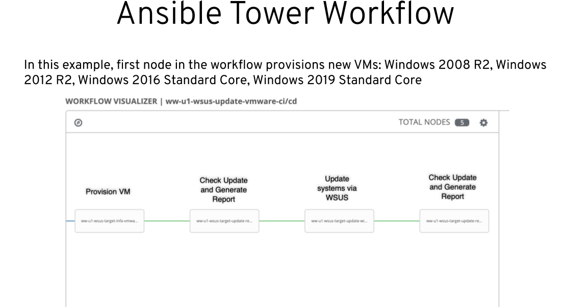
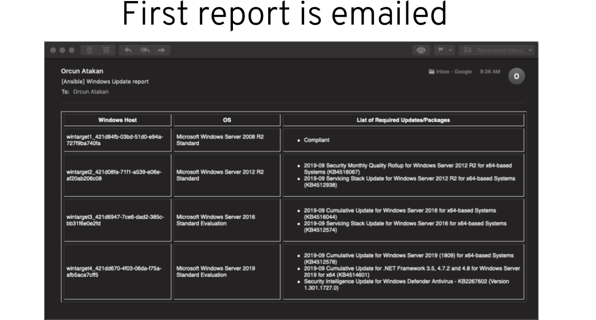
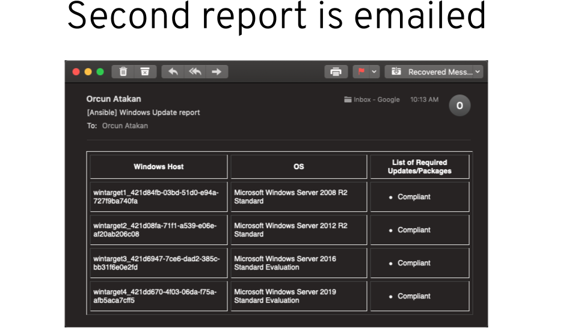

# ansible-windows-wsus-example
This repo contains sample playbooks to set up WSUS on Windows systems. Here are some of the example use cases implemented:

### Provision target Windows VMs to VMware, Azure, Red Hat Virtualization, OpenShift environments
    - instance-create-azure.yml
    - instance-create-kubevirt.yml
    - instance-create-vmware.yml
    - instance-create-azure.yml
### Provision WSUS server VM onto VMware environment
    - instance-create-vmware-wsus-server.yml
### Check and generate HTML update compliance report
    - check_windows_updates_with_report.yml
### Email compliance report
    - check_windows_updates_with_report.yml
### Update Windows systems to latest approved patches via WSUS server
    - update_windows.yml
### Apply specific Windows updates
    - update_specific_patch_windows.yml
### Patch and manage app restarts
    - update_windows_with_app.yml
### Configure Windows systems to pull updates from a WSUS server
    - update_windows.yml
### Provision WSUS server
    - provision-wsus-server.yml
### Configure WSUS server
    - wsus-server-configure.yml
### Enable auto-approval on WSUS server
    - wsus-server-auto-approval.yml
### Pull report from WSUS server and send an email
    - check_windows_updates_with_report_from_wsus.yml
### Remove computer object from WSUS server
    - remove-from-wsus.yml
### Cleanup old records on WSUS server
    - wsus-server-cleanup.yml
### Pull credentials from cyberark
    - cyberark_example.yml
    
## Example implementation of patching and reporting with Ansible Automation Platform

